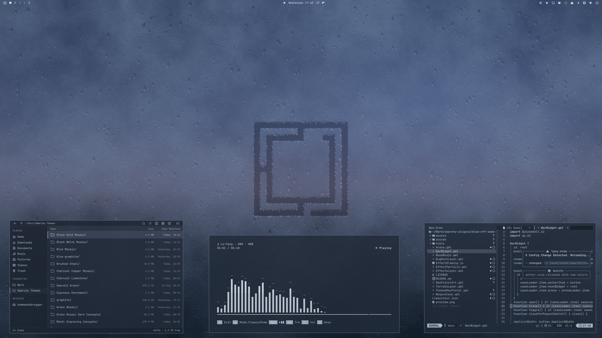
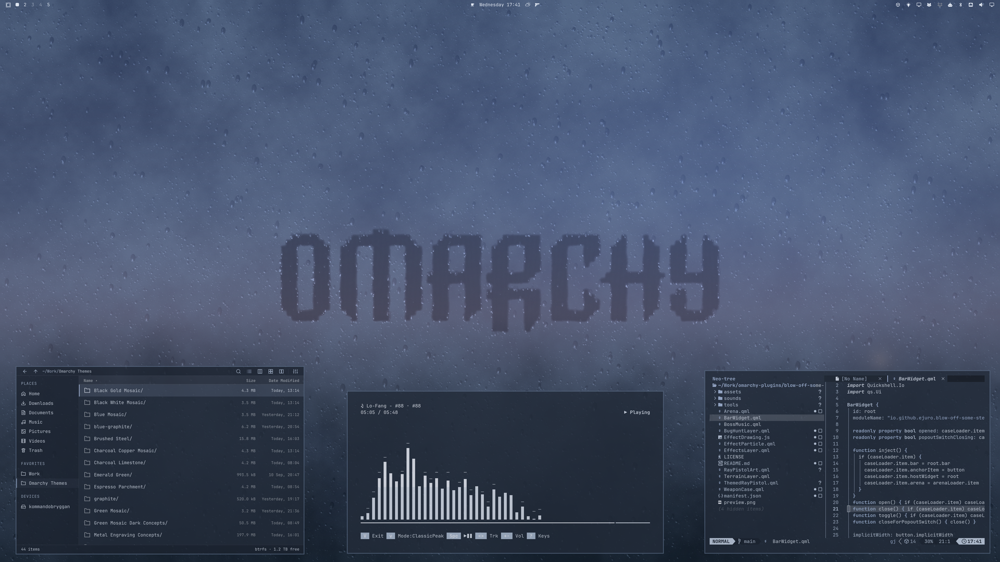
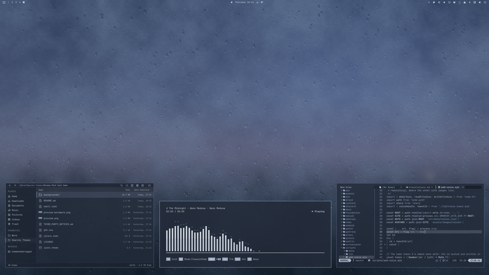

# Blue Hour

Blue twilight through misted glass, with slate-blue surfaces and a coordinated dark interface.







## Install

For **Omarchy 4 with Omarchy Shell**:

```sh
omarchy theme install https://github.com/ejuro/omarchy-blue-hour-theme
```

Use `omarchy theme bg next` to cycle through the logo, wordmark, and background-only wallpapers.

## The theme

- Misted glass with Omarchy artwork traced through the condensation, plus a background-only variant.
- A transparent top bar with text selected from the theme's palette.
- Deep slate-blue surfaces, cool blue accents, and pale silver text.
- Translucent menus and shell panels, coordinated terminal and editor colors, GTK 3 / GTK 4 styling, and Adwaita icons.

## Wallpapers

Three **2560 × 1440** wallpapers are included.

[Logo](backgrounds/01-blue-hour-logo.png) · [Wordmark](backgrounds/02-blue-hour-wordmark.png) · [Background only](backgrounds/03-blue-hour-background.png)

## Misted Glass collection

[Misty Sunset](https://github.com/ejuro/omarchy-misty-sunset-theme) · [Blue Hour](https://github.com/ejuro/omarchy-blue-hour-theme) · [Cool Dawn](https://github.com/ejuro/omarchy-cool-dawn-theme)

## License

[MIT](LICENSE) · [Omarchy artwork attribution](THIRD_PARTY_NOTICES.md)
